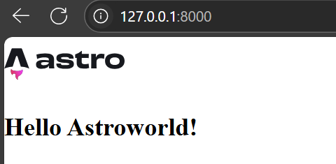

# Integrating Rust with Astro Using Rinja
This post is fully inspired by [go-templates-with-astro](https://www.wingravity.com/blog/go-templates-with-astro).


We'll walk through how to inject data from Rust to [Astro](https://astro.build) with the help of [Rinja](https://rinja.readthedocs.io/) templating engine.

## Prerequisites

Ensure you have [Rust](https://www.rust-lang.org/tools/install) and [Node.js](https://nodejs.org/en/download/) installed.

## Backend Setup

Initialize a new Rust project:

```bash
cargo new astro-rust
cd astro-rust
cargo add axum rinja_axum tokio tower-http --features tower-http/fs,tokio/rt-multi-thread
```

### Customizing Rinja Syntax

To prevent conflicts between Rinja and Astro's syntax, we'll define some custom syntax.

Create a `rinja.toml` file in the project root directory:

```toml
[general]
# We'll call our frontend directory "frontend" (very creative).
# "frontend/dist" is where the built frontend files will live.
dirs = ["frontend/dist/"]
default_syntax = "astro"

[[syntax]]
name = "astro"
# Custom delimiters to avoid conflicts with Astro's syntax.
expr_start = "[[."
expr_end = "]]"
comment_start = "%[[#"
comment_end = "#]]"
block_start = "%%"
block_end = "%%"

# These custom delimiters are ver easy to forget.
# Consider choosing more intuitive syntax if you plan on not checking this file every once and a while.
```

### Rust Server

Now we'll implement our Axum server using Rinja templates:

`src/main.rs`:

```rust
use axum::{
    Router,
    response::{Html, IntoResponse},
    routing::get,
};
use rinja_axum::Template;
use tower_http::services::ServeDir;

#[tokio::main]
async fn main() {
    let app = Router::new()
        .route("/", get(handler))
        .fallback_service(ServeDir::new("frontend/dist"));

    let listener = tokio::net::TcpListener::bind("127.0.0.1:8000")
        .await
        .unwrap();
    axum::serve(listener, app).await.unwrap();
}

#[derive(Template)]
#[template(path = "index.html")]
struct NameTemplate<'a> {
    name: &'a str,
}

async fn handler() -> impl IntoResponse {
    Html(NameTemplate { name: "Astroworld" }.render().unwrap())
}
```

## Frontend Setup (Astro)

Create a new Astro project 

```bash
npm create astro@latest
```

When prompted:

- **Project name:** `frontend`
    
- Accept the defaults or modify as needed.
    

### Create Template

Inside `frontend/src/pages`, create (if it doesn't already exist) or edit `index.astro`:

```astro
---
import astroLogo from "../assets/astro.svg";
---

<div id="container">
  <main>
    <section id="hero">
      <a href="https://astro.build">
        
      </a>
      <!-- Injected variable -->
      <h1>Hello [[.name]]!</h1>
    </section>
  </main>
</div>
```

### Build the Frontend

`npm run dev` won’t work for our use case since it doesn't build to the `dist/` directory. Instead we'll use `npm run build`:

```bash
cd frontend
npm run build
cd ..
cargo run
```

Then, open your browser and navigate to:

```
http://localhost:8000
```

You should see our SSR dynamic content generated


## Note

If you're containerizing your project:

- Make sure to copy the `frontend/dist` directory into your Docker image.
- If you're building the image using GitHub Actions, remove or comment out the `dist/` line from `frontend/.gitignore` so that the built assets are included.
    
## Conclusion

We now have a separate Rust backend working alongside a standalone Astro frontend. If we need more interactivity, we can easily introduce [HTMX](https://htmx.org/) to our mix for dynamic behavior, or even integrate React directly into the Astro framework, that is if we need more dependencies and a lot of JavaScript loaded to the site.

The code for this project is available on GitHub:
[abd0-omar/astro-rust](https://github.com/abd0-omar/astro-rust)

The code for the blog is available here
[abd0-omar/contact-form](https://github.com/abd0-omar/contact-form)
