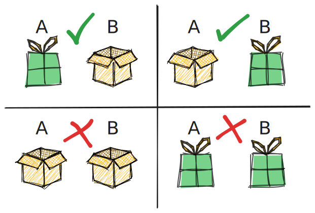
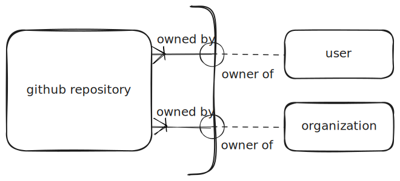
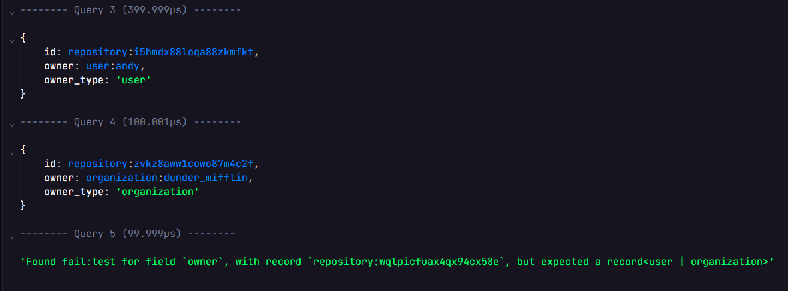

# How to enforce XOR (Either/Or) Fields in SurrealDB 

When designing a database schema, you could encounter situations where a record
should contain one of two possible fields, but not both or neither. For example, a
`repository` might be owned by either a `user` or an `organization`, but never
both simultaneously or neither. This is known as an XOR or "either/or" constraint.



## Arc Relationship
This scenario is also known as an Arc Relationship in Entity Relationship modeling.
In ER Diagram, it is shown by drawing an arc across the relationship lines,
hence the name arc relationship.



## SurrealDB

### The Complete Schema

Here is the complete schema definition for our `repository` table to showcase how
to enforce the XOR constraint.

### Defining the schema
```sql
DEFINE TABLE repository SCHEMAFULL;

DEFINE FIELD name ON repository TYPE string;
-- Use `option<>` to allow fields to be omitted before the XOR check
DEFINE FIELD user ON repository TYPE option<record<user>>;
DEFINE FIELD organization ON repository TYPE option<record<organization>>;
```

### Defining the XOR check

```sql
-- Fields in surrealdb are represented as a key-value pair
-- `VALUE` is used to get the raw "value" of the field and omitting the "key"
DEFINE FIELD owner_type ON repository VALUE {
    -- 1. Check if NEITHER is set
    IF user = NONE AND organization = NONE {
        THROW "a repository requires either a user or an organization owner";
    }
    -- 2. Check if BOTH are set
    ELSE IF user != NONE AND organization != NONE {
        THROW "a repository cannot have both a user and an organization owner";
    };
    -- 3. (Optional) If validation passes, return the owner type
    RETURN IF user != NONE {
        'user';
    } ELSE {
        'organization';
    };
};
```

### Testing

```sql
-- Creating a repository with just a user owner
CREATE repository SET
    name = 'my_repo',
    user = user:abdo;

-- Creating a repository with just an organization owner
CREATE repository SET
    name = 'my_repo',
    organization = organization:abdo;

-- ERROR: Fails because BOTH user and organization are set.
CREATE repository SET
    name = 'hamadas_repo',
    user = user:hamada,
    organization = organization:hamada_org;
-- Throws: 'An error occurred: a repository cannot have both a user and an organization owner'

-- ERROR: Fails because NEITHER user nor organization is set.
CREATE repository SET
    name = 'hamada_repo';
-- Throws: 'An error occurred: a repository requires either a user or an organization owner'
```

you can play around with it more by copying and pasting the code into
[Surrealist](https://app.surrealdb.com/c/sandbox/query).

## SurrealDB Cleaner Solution

A cleaner way approach was suggested by `jimpex` on [surrealdb discord](https://discord.com/channels/902568124350599239/970338835990974484/1406455766952444038).

```sql
DEFINE FIELD owner ON repository TYPE record<user | organization>;
DEFINE FIELD owner_type ON repository VALUE record::tb(owner);

CREATE ONLY repository SET owner = user:andy;
CREATE ONLY repository SET owner = organization:dunder_mifflin;
CREATE ONLY repository SET owner = fail:test;
```


## SQL
For those coming from a relational background, this same logic is typically
handled using a `CHECK` constraint in the table definition.

```sql
CREATE TABLE users (
    id INT PRIMARY KEY,
    name VARCHAR(255) NOT NULL
);

CREATE TABLE organizations (
    id INT PRIMARY KEY,
    name VARCHAR(255) NOT NULL
);

CREATE TABLE repository (
    id INT PRIMARY KEY,
    name VARCHAR(255) NOT NULL,
    
    user_id INT,
    organization_id INT,
    
    FOREIGN KEY (user_id) REFERENCES users(id),
    FOREIGN KEY (organization_id) REFERENCES organizations(id),
    
    CONSTRAINT owner_xor_check CHECK (
        (user_id IS NOT NULL AND organization_id IS NULL)
        OR
        (user_id IS NULL AND organization_id IS NOT NULL)
    )
);
```

This approach moves validation logic out of your application and into the schema
itself, so the database becomes the single source of truth.

I hope this helps you understand arc relationships and how to enforce XOR fields
in SurrealDB. If you want to learn more about SurrealDB, you can check out the official
documentation [here](https://surrealdb.com/docs/surrealdb).
