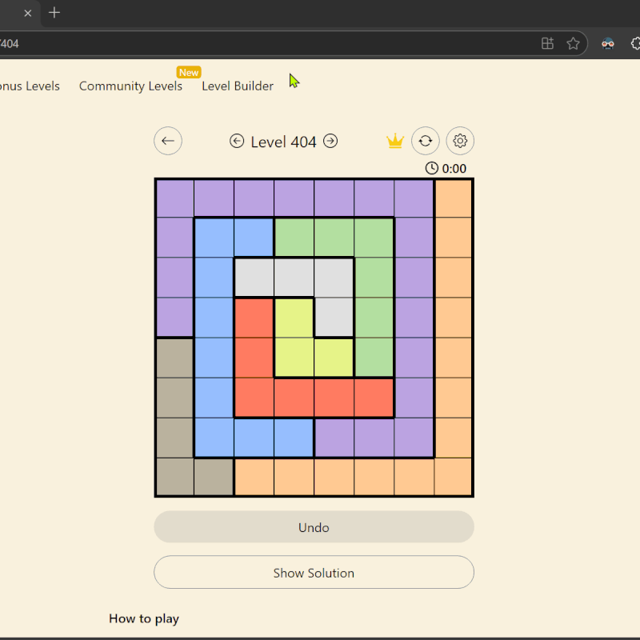

# Demo

[GitHub Link](https://github.com/abd0-omar/linkedin_queens)

# Contribution solution button with extra features to other repo

[Contribution PR](https://github.com/samimsu/queens-game-linkedin/pull/678)

the project is a work in progrss